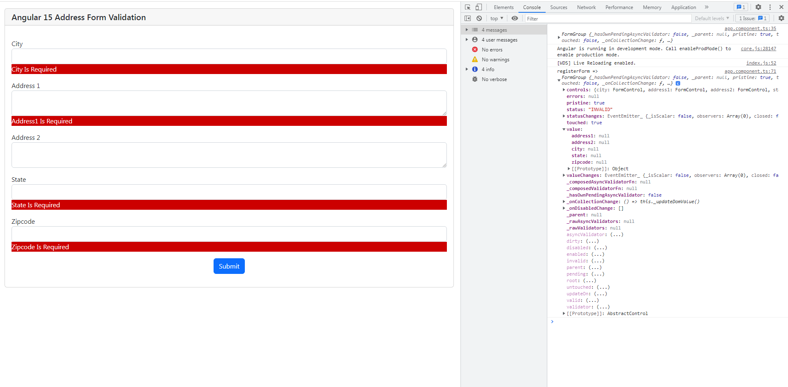
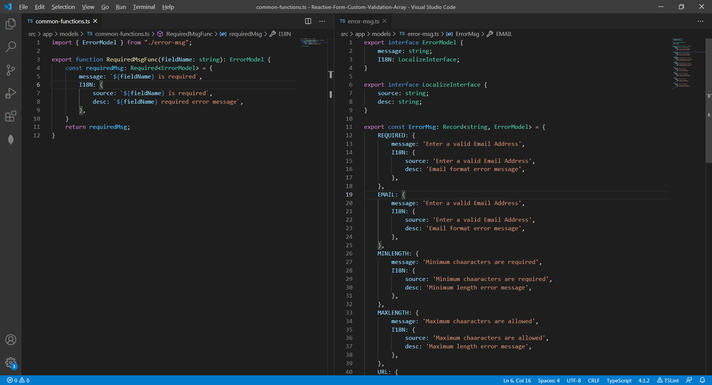

# Reactive Form Custom validation uing Array


I have taken these fields city, address1, address2, state, zipcode. Only address2 is not required field.

### address-form.ts
```
export class AddressForm {
  city: string | undefined;
  address1: string | undefined;
  address2: string | undefined;
  state: string | undefined;
  zipcode: string | undefined;
}
```

### Typescript Utility types



### app.component.html
error component with showError & field input values to display error.

```
<!-- main app container -->
<div class="card m-3">
  <h5 class="card-header">Angular 15 Address Form Validation</h5>
  <div class="card-body">
    <form
      *ngIf="registerForm"
      [formGroup]="registerForm"
      (ngSubmit)="onSubmit()"
    >
        <div class="mb-3 mt-3">
          <label>City</label>
          <input type="text" formControlName="city" class="form-control" />
          <app-error
            [showError]="showError"
            [field]="registerForm.controls['city']"
          ></app-error>
        </div>
      <div class="mb-3 mt-3">
        <label>Address 1</label>
        <textarea formControlName="address1" class="form-control"></textarea>
        <app-error
          [showError]="showError"
          [field]="registerForm.controls['address1']"
        ></app-error>
      </div>
      <div class="mb-3 mt-3">
        <label>Address 2</label>
        <textarea formControlName="address2" class="form-control"></textarea>
        <app-error
          [showError]="showError"
          [field]="registerForm.controls['address2']"
        ></app-error>
      </div>
      <div class="mb-3 mt-3">
        <label>State</label>
        <input type="text" formControlName="state" class="form-control" />
        <app-error
          [showError]="showError"
          [field]="registerForm.controls['state']"
        ></app-error>
      </div>
      <div class="mb-3 mt-3">
        <label>Zipcode</label>
        <input type="text" formControlName="zipcode" class="form-control" />
        <app-error
          [showError]="showError"
          [field]="registerForm.controls['zipcode']"
        ></app-error>
      </div>
      <div class="mb-3 mt-3 text-center">
        <button type="submit" class="btn btn-primary mr-5">Submit</button>
      </div>
    </form>
  </div>
</div>
```

### app.component.ts
[controlname].setValidators programmatically adds the sync validators. Passing custom validators names through customValidatorArray of FormValidatorService. Using customValidatorArray, will fetch custom validators from customValidatorsMap and return the validators array.

```
customValidatorArray(fieldName: string, validators: string[]): ValidatorFn[] {
    const arr = [];
    for (const validator of validators) {
      if(validator === 'requiredValidator') {
        this.customValidatorsMap.set(
          'requiredValidator',
          CustomValidators.requiredValidator(fieldName)
        );
      }
      arr.push(this.customValidatorsMap.get(validator));
    }
    return arr as ValidatorFn[]; // type casting
  }
```

```
import { Component, OnInit } from '@angular/core';
import { AbstractControl, FormControl, FormGroup } from '@angular/forms';
import { AddressForm } from './models/address-form';
import { FormValidatorService } from './services/form-validator/form-validator.service';

@Component({
  selector: 'app-root',
  templateUrl: './app.component.html',
  styleUrls: ['./app.component.css'],
})
export class AppComponent implements OnInit {
  registerForm: FormGroup = new FormGroup({});
  addressDetails: AddressForm;
  submitted = false;
  showError: boolean = false;
  showZipCode: boolean = false;
  selectedCountryCode: string | undefined;

  constructor(private formValidatorService: FormValidatorService) {
    this.addressDetails = new AddressForm();
  }

  ngOnInit() {
    this.initForm();
  }

  initForm(): void {
    this.registerForm = new FormGroup({
      city: new FormControl(this.addressDetails.city),
      address1: new FormControl(this.addressDetails.address1),
      address2: new FormControl(this.addressDetails.address2),
      state: new FormControl(this.addressDetails.state),
      zipcode: new FormControl(this.addressDetails.zipcode),
    });
    console.log(this.registerForm);
    this.validateControls();
  }

  validateControls() {
    const city = this.registerForm.get('city') as FormControl;
    const address1 = this.registerForm.get('address1') as FormControl;
    const address2 = this.registerForm.get('address2') as FormControl;
    const state = this.registerForm.get('state') as FormControl;
    const zipcode = this.registerForm.get('zipcode') as FormControl;

    city.setValidators(
      this.formValidatorService.customValidatorArray('city', [
        'requiredValidator',
        'stringWithSpaceOnlyValidator',
      ])
    );
    address1.setValidators(
      this.formValidatorService.customValidatorArray('address1', ['requiredValidator'])
    );
    state.setValidators(
      this.formValidatorService.customValidatorArray('state', [
        'requiredValidator',
        'stringWithSpaceOnlyValidator',
      ])
    );
    zipcode.setValidators(
      this.formValidatorService.customValidatorArray('zipcode', [
        'requiredValidator',
        'zipcodeValidator',
      ])
    );
  }

  onSubmit() {
    this.submitted = true;
    console.log('registerForm => ', this.registerForm);
    this.checkRequiredFields(this.registerForm.controls);
    if (this.registerForm.invalid) {
      this.showError = true;
      return false;
    }
    this.showError = false;
    return true;
  }

  checkRequiredFields(formControls: {
    [key: string]: AbstractControl;
  }) {
    Object.keys(formControls).forEach((formControlKey) => {
      if (formControls[formControlKey]?.errors?.required) {
        this.formControlMarkAsTouched(formControlKey);
      }
    });
  }

  formControlMarkAsTouched(formControlKey: string) {
    this.registerForm.controls[formControlKey].markAsTouched();
  }
}
```

### custom-validator.ts
Create custom controls for validations
```
import { AbstractControl, ValidationErrors, ValidatorFn } from '@angular/forms';
import { RequiredMsgFunc } from './common-functions';
import { ErrorMsg } from './error-msg';

export class CustomValidators {
  public static patternValidator(
    regex: RegExp,
    error: ValidationErrors
  ): ValidatorFn {
    return (control: AbstractControl): ValidationErrors | null => {
      if (!control?.value?.trim() || control?.value?.trim().length === 0) {
        return null;
      }
      const valid: boolean =
        control?.value?.trim().length >= 1 &&
        this.isPatternMatched(regex, control.value);
      console.log('valid => ', this.isPatternMatched(regex, control.value));
      return valid ? null : error;
    };
  }
  public static isPatternMatched(regex: RegExp, controlValue: string): boolean {
    return regex.test(controlValue);
  }
  public static isSpaceAvailable(control: AbstractControl) {
    return (control.value || '').trim()?.length === 0;
  }
  public static maximumOneWhitespacePresent(control: AbstractControl) {
    return control.value.trim().indexOf('  ') === -1;
  }
  public static isValidYear(year: number) {
    const currentYear: number = new Date().getFullYear();
    if (year && currentYear >= year && year >= 1000) {
      return true;
    }
    return false;
  }
  public static mobileValidator(): ValidatorFn {
    const regex : RegExp = new RegExp('^\\d{10}$');
    return (control: AbstractControl): ValidationErrors | null => {
      return control.value && !this.isPatternMatched(regex, control.value)
        ? { url: ErrorMsg.MOBILE }
        : null;
    };
  }
  public static requiredValidator(fieldName: string): ValidatorFn {
    return (control: AbstractControl): ValidationErrors | null => {
      if (
        control?.value == null ||
        (typeof control.value === 'string' && this.isSpaceAvailable(control))
      ) {
        return {
          required: { message: RequiredMsgFunc(fieldName).message },
        };
      }
      return null;
    };
  }
  public static urlValidator(): ValidatorFn {
    const regex : RegExp = new RegExp('(https?:\\/\\/)|(www\\.)');
    return (control: AbstractControl): ValidationErrors | null => {
      return control.value && !this.isPatternMatched(regex, control.value)
        ? { url: ErrorMsg.URL }
        : null;
    };
  }
  public static email(): ValidatorFn {
    return (control: AbstractControl): ValidationErrors | null => {
      return control.value && !this.isValidEmail(control.value)
        ? { email: ErrorMsg.EMAIL }
        : null;
    };
  }
  public static isValidEmail(email: string): boolean {
    const regx : RegExp = new RegExp(
      "^([\\w.\\-'/&])+@([\\w\\-])+\\.(\\w)([\\w.\\-])*$"
    );
    return regx.test(email);
  }
  public static yearValidator(): ValidatorFn {
    return (control: AbstractControl): ValidationErrors | null => {
      const isValid = this.isValidYear(control.value);
      return isValid ? null : { year: ErrorMsg.YEAR };
    };
  }
  public static zipcodeValidator(regex: RegExp): ValidatorFn {
    return (control: AbstractControl): ValidationErrors | null => {
      return control.value && !this.isPatternMatched(regex, control.value)
        ? { zipcode: ErrorMsg.ZIP }
        : null;
    };
  }
  public static minLength(minLength: number): ValidatorFn {
    return (control: AbstractControl): ValidationErrors | null => {
      return control.value && control.value?.length < minLength
        ? { minLength: ErrorMsg.MINLENGTH }
        : null;
    };
  }
  public static maxLength(maxLength: number): ValidatorFn {
    return (control: AbstractControl): ValidationErrors | null => {
      return control.value && control.value?.lengt > maxLength
        ? { maxLength: ErrorMsg.MAXLENGTH }
        : null;
    };
  }
}
```

